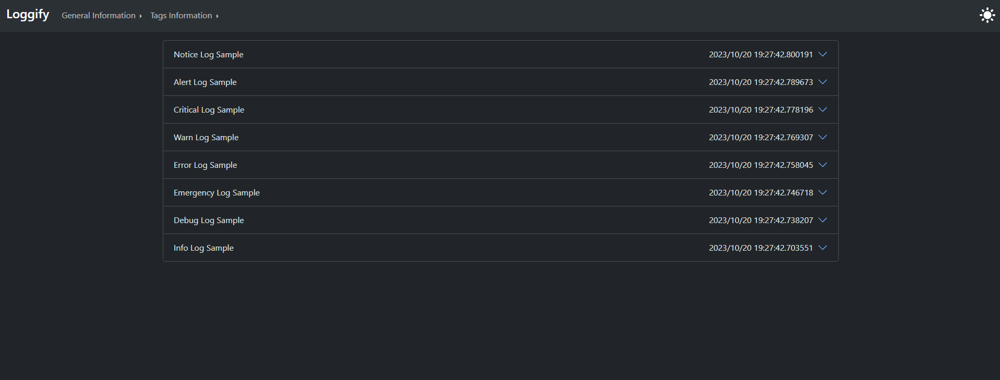
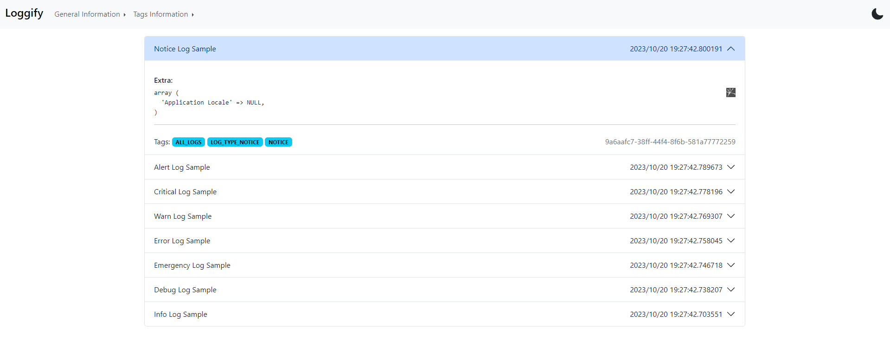
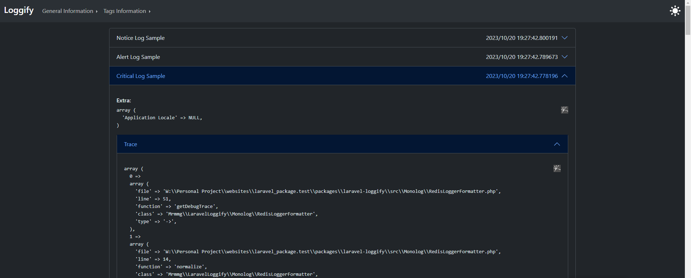
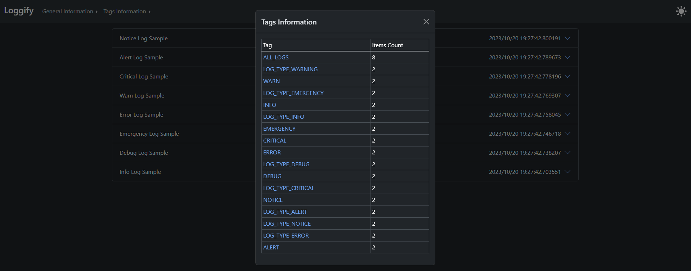

# Loggify
Manage Laravel Logs With Tag & Extra Powerful Options.
### The meaning
Based on ChatGPT response `"Loggify" is not a standard word in the English language, and it doesn't have an established definition. you can define it as something like: To streamline or enhance the process of creating and managing logs or records, especially in a digital or data-driven context. This may involve automating log generation, improving log organization, or making logs more user-friendly for analysis and monitoring purposes.`
### What do this package?
This package helps Laravel developers to store application log in redis database (for now!) and also categorize the logs with a tag system! then they can walk through in logs with tags.

## Getting Started

### Before Install
Since this package use redis to store and manage logs please consider to configure laravel to works with redis. Also remember that install the redis requirement for laravel like `predis`.

### Installation
```shell
composer require mrmmg/laravel_loggify 
```

Then Publish loggify assets & config with running
```shell
php artisan loggify:install
```
This command create `loggify.php` config file in `config` directory and create loggify assets in `public/verndor/loggify`.

## Configuration
The `loggify.php` config file is self documented with comment blocks, however I explain again:

#### Database and Redis ```database.redis```

Like Laravel `config/database.php` this section describe the redis connection, you can change them. By default, all logs stores in redis database 10.
```php
'database' => [
        'redis' => [
            'client' => env('REDIS_CLIENT', 'phpredis'),

            'url' => env('REDIS_URL'),
            'host' => env('REDIS_HOST', '127.0.0.1'),
            'username' => env('REDIS_USERNAME'),
            'password' => env('REDIS_PASSWORD'),
            'port' => env('REDIS_PORT', '6379'),
            'database' => '10',
        ]
    ],
```

### Logging ```logging```

This section is used to define loggify log channel option. You don't need to change anything in this section.

### Log Expiration ```log_expire_seconds```

Redis is an in-memory database, and we cannot use too much memory for logs, so we can define how many seconds that the redis holds log items By Default it holds log items for 1 day (86400 seconds).

### Log Tag Limits ```max_tag_items```
**Not Implemented Yet**

This option control each log tag can hold how many items.

### Guards ```guard```
**Not Implemented Yet**

This options control access to loggify web panel with laravel middlewares.

## Usage
By use laravel Log Facade you can use loggify.
### Examples
```php
use Illuminate\Support\Facades\Log;

Log::channel('loggify')->info("Info Log Sample");
```

So where is the extra options?!

The second parameter of laravel log methods called `context`, the loggify use this to manage `tags` and `extra` log data. let's complete the previous example:

```php
use Illuminate\Support\Facades\Log;

Log::channel('loggify')
            ->info("Info Log Sample", [
                'tags' => ['MY_CUSTOM_TAG']
            ]);
```
Done! you create a log that tagged with `MY_CUSTOM_TAG`! you can use as many as you want for tagging, there is no limit.

```php
use Illuminate\Support\Facades\Log;

$user_id = \Illuminate\Support\Facades\Auth::id();
$user_type = ...;

Log::channel('loggify')
            ->info("User Logged-In", [
                'tags' => [
                    "USER_$user_id",
                    "API_VERSION_1",
                    "USER_TYPE_$user_type"
                ]
            ]);
```

Add extra data to log context

```php
use Illuminate\Support\Facades\Log;

Log::channel('loggify')
            ->info("Info Log Sample", [
                'tags' => ['INFO'],
                'extra' => ['Application Locale' => config('app.locale')]
            ]);
```

The other `context` elements store as `context` in log stack (the default laravel behavior).

```php
use Illuminate\Support\Facades\Log;

Log::channel('loggify')
            ->info("Info Log Sample", [
                'tags' => ['INFO'],
                'extra' => ['Application Locale' => config('app.locale')],
                'request_data' => $request->all()
            ]);
```

In above example the `request_data` stores in `context` but the `tags` and `extra` stores in other log part.

### Trace System
Loggify can help you to debug/find issues of you application by storing the php debug backtrace feature, you don't need to do anything, the Loggify store backtrace for log with these type

- debug
- alert
- critical
- emergency
- error
- warning

#### Examples
```php
use Illuminate\Support\Facades\Log;

Log::channel('loggify')
            ->debug(...)
            
Log::channel('loggify')
            ->alert(...)

Log::channel('loggify')
            ->critical(...)

Log::channel('loggify')
            ->emergency(...)

Log::channel('loggify')
            ->error(...)

Log::channel('loggify')
            ->warning(...)
```

All above log example store the debug backtrace in database, and you can view them in Loggify web panel.

### The Default Tags
By default, Loggify add two tags to your tags, `ALL_LOGS` and `LOG_TYPE_{laravel_log_type}`. for example:

```php
use Illuminate\Support\Facades\Log;

Log::channel('loggify')
            ->info("Info Log Sample", [
                'tags' => ['INFO'],
                'extra' => ['Application Locale' => config('app.locale')],
                'request_data' => $request->all()
            ]);
```

The above log can be found in web panel with `ALL_LOGS`, `LOG_TYPE_INFO` and `INFO` tag.

### Web Panel
To view to stored log you can open a browser and use `/loggify` route to view you logs.

By passing the log tag after that url the Loggify shows the tag logs, for example `/loggify/ALERT` show all logs that tagged with `ALERT` tag.

#### Screenshots

##### Dark/Light Theme



##### Log with Trace


##### Tags Information



## Todo
- [ ] Implement tag items limit
- [ ] Implement access management to web panel
- [ ] Implement tests
- [ ] Make Better document and GitHub pages
